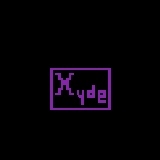

# What is Xyde?
Xyde is a Roblox script that supports multiple games.
# How to use Xyde?
Install any Roblox executor and paste this script into it:
```
-- get key from https://macha.lol or https://work.ink/2ba3/xyde-key-system or https://xxmacha.pythonanywhere.com
key = "YOUR KEY" 
loadstring(game:HttpGet('https://raw.githubusercontent.com/xMacha/Xyde/refs/heads/main/source/XydeLoader.lua'))()
```
I recommend downloading an executor from https://whatexpsare.online/
# Supported games
- Specter
- Blox Fruits
# How to get key
To get a key, you need to go to https://macha.lol and complete the work.ink steps.


**Our [Discord](https://discord.gg/p9jCxg5m)**

